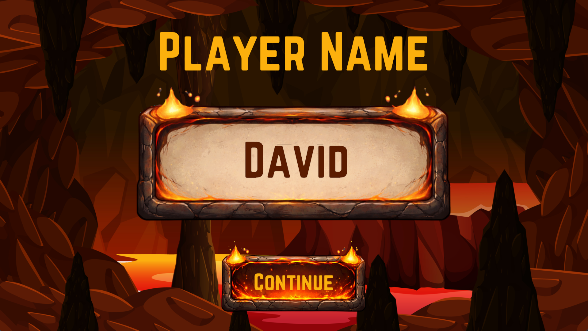
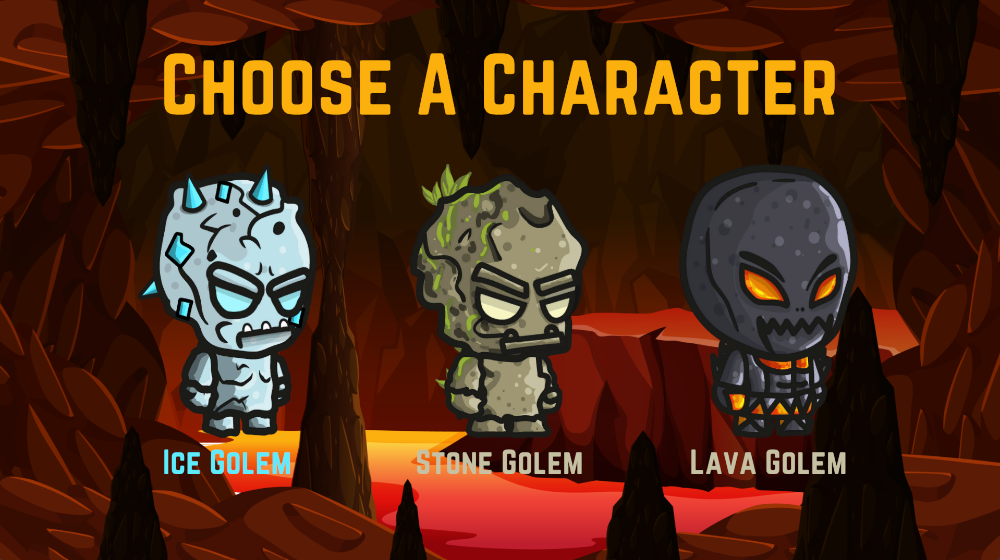
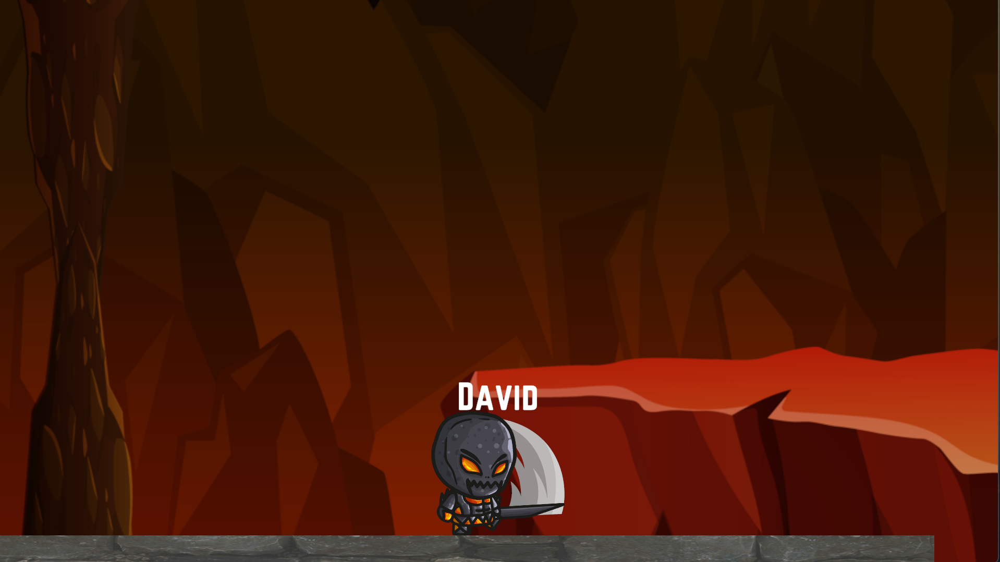

# ⚔️ Dungeon Coop Quest

> A cooperative multiplayer dungeon crawler prototype developed in Unity, focused on real-time networking, room management, and synchronized gameplay systems.

---

## Overview

Dungeon Coop Quest is a multiplayer game prototype developed using Unity, C#, and Photon Networking.

The project was created to explore the technical challenges of online multiplayer game development, including player synchronization, room creation systems, networked interactions, and cooperative gameplay mechanics.

Players can create or join multiplayer rooms, explore dungeons together, and interact within a synchronized game environment.

This project provided hands-on experience with multiplayer architecture and networking concepts commonly used in modern online games.

---

## Downloads

### Windows Version

[Download for Windows](YOUR_WINDOWS_DOWNLOAD_LINK)

---

## Project Information

| Category | Details |
|-----------|---------|
| Project Type | Multiplayer Game Prototype |
| Platforms | Windows, macOS |
| Engine | Unity |
| Programming Language | C# |
| Networking Solution | Photon PUN |
| Game Mode | Cooperative Multiplayer |
| Development Type | Solo Developer Project |
| Project Status | Completed Prototype |

---

## Core Gameplay

### Create Multiplayer Rooms

Players can create private multiplayer sessions and invite others to join.

### Join Existing Sessions

Connect to available rooms and immediately participate in cooperative gameplay.

### Cooperative Exploration

Explore dungeon environments together while interacting within a synchronized multiplayer world.

### Real-Time Networking

Player movement, room states, and gameplay interactions are synchronized across connected clients.

---

## Key Features

### Multiplayer Room System

Create, join, and manage online multiplayer rooms.

### Photon Networking Integration

Implemented using Photon PUN for reliable real-time communication.

### Player Synchronization

Networked player movement and interactions across multiple clients.

### Cooperative Gameplay

Supports multiple players participating in shared gameplay sessions.

### Network Architecture Learning

Designed to explore multiplayer development principles and scalable networking systems.

### Cross-Platform Desktop Support

Built for Windows and macOS desktop platforms.

---

## Screenshots

<table>
<tr>
<td align="center">
<b>Main Menu</b> 

</td>

<td align="center">
<b>Name Input</b> 

</td>

<td align="center">
<b>Character Selectiont</b> 

</td>

<td align="center">
<b>Room Lobby</b> 

</td>
</tr>
</table>

---

## Project Highlights

- Developed using Photon PUN networking
- Supports online multiplayer room creation and joining
- Implements synchronized player interactions
- Explores real-time networking architecture
- Designed as a technical learning project focused on multiplayer systems
- Demonstrates understanding of client-server communication concepts
- Expands beyond single-player game development into online experiences

---

## Gameplay Demo

Watch a short gameplay demonstration showcasing room creation, multiplayer synchronization, and cooperative gameplay.

🎥 Dungeon Coop Quest Gameplay Demo

[Watch Gameplay Demo](YOUR_VIDEO_LINK)

---

## Technologies Used

- Unity Engine
- C#
- Photon PUN
- Multiplayer Networking
- Remote Procedure Calls (RPC)
- Network Synchronization
- Unity UI System
- Git & GitHub

---

## My Contributions

As the sole developer of Dungeon Coop Quest, I was responsible for:

- Game Design
- Multiplayer Architecture
- Photon Networking Integration
- Room Creation System
- Player Synchronization
- Network Event Management
- UI/UX Design
- Gameplay Programming
- Testing and Debugging

---

## Technical Challenges

During development, several multiplayer systems were designed and implemented:

- Multiplayer room management
- Player spawning architecture
- Network synchronization
- Remote Procedure Call (RPC) communication
- Lobby and matchmaking systems
- Multiplayer UI flow
- Session management
- Real-time state synchronization

---

## What I Learned

This project significantly expanded my understanding of multiplayer game development and networking concepts.

Key learning areas included:

- Multiplayer architecture design
- Client-server communication
- Real-time synchronization
- Network optimization principles
- Multiplayer gameplay systems
- Photon PUN implementation

---

## Future Improvements

- Dedicated Matchmaking System
- Character Classes
- Enemy AI Synchronization
- Multiplayer Combat System
- Inventory System
- Dedicated Server Support
- Additional Dungeon Levels
- Cross-Platform Multiplayer Expansion

---

## Developer

**David Nathaniel Miranda**

Software Developer | Unity Game Developer | Web Developer

GitHub:  
[David Miranda GitHub](https://github.com/davidmiranda-gamedev)

LinkedIn:  
[David Miranda LinkedIn](https://www.linkedin.com/in/davidnmiranda/)

---

⭐ If you enjoyed this project, feel free to explore my other repositories and educational game projects.
